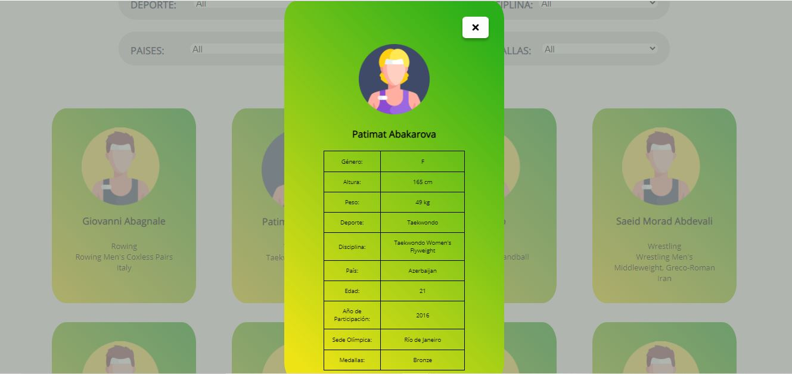
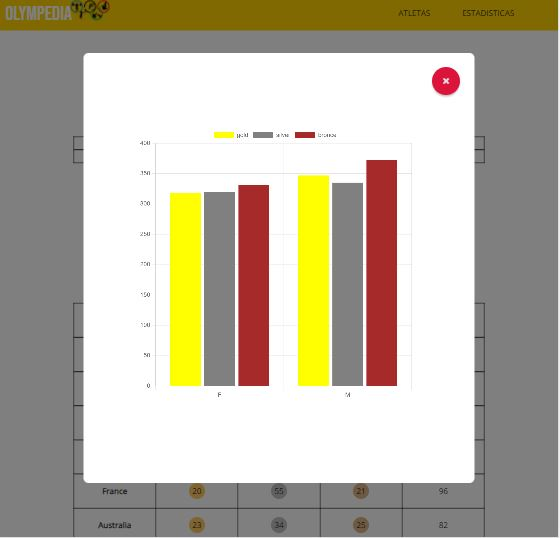
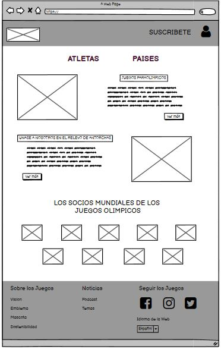
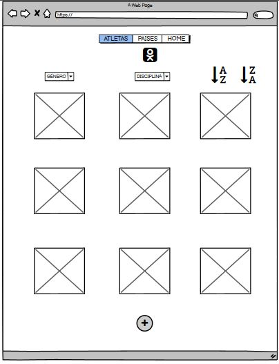
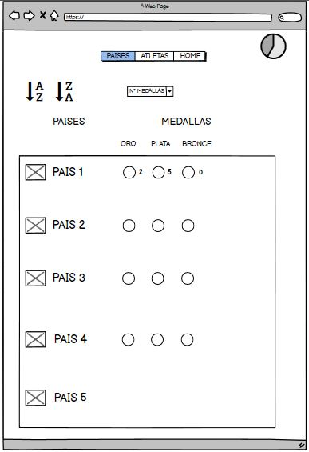
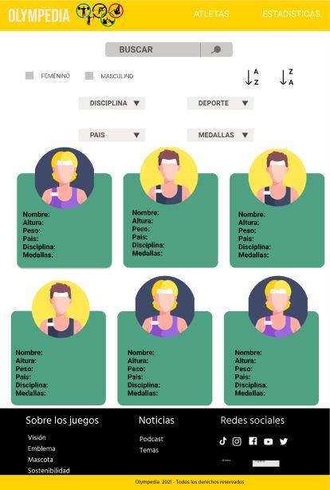
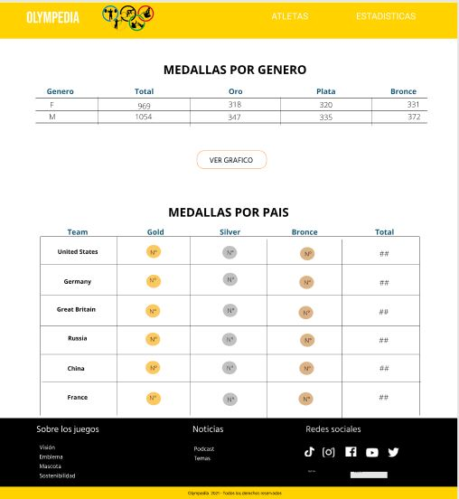
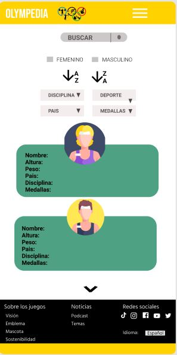
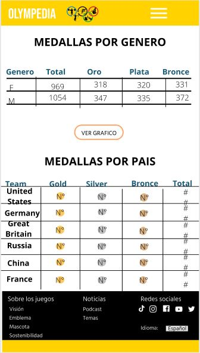

# OLYMPEDIA

## Índice

* [1. Definición del producto](#1-definición-del-producto)
* [2. Plan de acción](#2-plan-de-acción)
* [3. Resumen del proyecto](#3-resumen-del-proyecto)
* [4. Historias de usuario](#4-historias-de-usuario)
* [5. Sketch de solución](#5-sketch-de-solución)
* [6. Test de usabilidad](#6-test-de-usabilidad)
* [7. Diseño de la interfaz de usuario](#7-diseño-de-la-interfaz-de-usuario)
* [8. Zeplin](#8-zeplin)
* [9. Autoras](#9-autoras)

***
## 1. Definición del producto

El producto está diseñado para que sea intuitivo para el usuario y así hacer de su experiencia
algo bueno para él o ella. Tomamos en cuenta qué tipo de información quisieran visualizar y según
ese planteamiento se desarrolló cada parte de la página web. Olympedia le facilita al usuario
la búsqueda el acceso a información relevante sobre cualquier atleta que quisiera buscar.

## 2. Plan de acción

* Realizar historias de usuario.

### UX

* Diseñar la aplicación pensando y entendiendo al usuario.
* Crear prototipos para obtener feedback e iterar.
* Aplicar los principios de diseño visual (contraste, alineación, jerarquía)
* Realizar tests de usabilidad.

### HTML y CSS

* Uso de HTML semántico.
* Uso de selectores de CSS.
* Uso de flexbox en CSS.

### JavaScript

* Uso de condicionales.
* Uso de bucles.
* Uso de funciones (parámetros | argumentos | valor de retorno).
* Manipular arrays (filter | map | sort | reduce).
* Uso ES modules.
* Diferenciar entre expression y statements.

### DOM y Web APIs

* Uso de selectores del DOM.
* Manejo de eventos del DOM.
* Manipulación dinámica del DOM.

### Testing

* Testeo unitario.

### Estructura del código y guía de estilo

* Organizar y dividir el código en módulos (Modularización).
* Uso de identificadores descriptivos.
* Uso de linter (ESLINT).

### Git y GitHub

* Uso de comandos de git (add | commit | pull | status | push).
* Manejo de repositorios de GitHub (clone | fork | gh-pages)
* Colaboración en Github (branches | pull requests | tags)

### Hacker edition

* Uso de Chart.js

## 3. Resumen del proyecto

Olympedia es una página web donde disponemos información sobre los atletas
de las olimpiadas de Brasil 2016; aquí podrás encontrar información específica
sobre cada uno de los atletas.
El objetivo principal de la página es satisfacer las necesidades de los aficionados
al deporte o personas comunes que estén interesadas en este tema, y así permitirles
navegar entre los datos que les parecen relevantes, teniendo como herramientas
el filtrado por país, deporte, disciplina, género y tipo de medalla, así mismo
puede ordenar alfabeticamente y buscar atletas por nombre. El flujo de navegación
parte desde una página principal teniendo como opciones ir al apartado de atletas
o estadísticas, en este último mostramos tablas y gráficos con datos sobre las medallas.

## 4. Historias de usuario
##### HISTORIA N°1:
Yo como aficionado al deporte quiero visualizar una pagina web responsive y poder seleccionar si deseo ver a los atletas o las estadísticas.

##### Criterios de aceptación:
- Crear la primera página.
- Desarrollo del HTML, CSS responsivo.
- Se podrá visualizar y seleccionar en la barra de navegación a los atletas o las estadísticas de los juegos olímpicos.

##### Definición de terminado:
- Ya sea si se ingrese desde una computadora, laptop, Tablet o celular el usuario podrá visualizar la pagina web de manera responsive.
- El usuario podrá desplazarse para que vea a los atletas o las estadísticas sobre los ganadores de las medallas.

##### HISTORIA N°2:
Yo como aficionado al deporte quiero poder visualizar a los atletas y poder ver todos sus datos, así como también poder buscarlos por su nombre.

##### Criterios de aceptación:
- Visualizar la lista de atletas en tarjetas.
- Visualizar la información de los atletas en modales.
- Crear el buscador.
- Al escribir en el buscador el nombre de cualquier atleta todas las coincidencias con el nombre aparecen en la pantalla.

##### Definición de terminado:
- Al ingresar a la página el usuario podrá ver a todos los atletas en tarjetas junto con su avatar, al presionar en cualquier tarjeta de los jugadores, se abrirá un modal con toda su información.
- Al empezar a escribir en el buscador por nombres se empezarán a quedar solo los atletas en los que en su nombre haya alguna coincidencia con los que se está escribiendo.

##### HISTORIA N°3:
Yo como aficionado al deporte quiero poder ordenar a los atletas por nombre ya sea de forma ascendente o descendente.

##### Criterios de aceptación:
- Crear los botones para poder ordenar.
- Buena funcionalidad al ordenar.
- Visualizar a los atletas ordenados ya sea desde la A-Z o viceversa.

##### Definición de terminado:
- Al ingresar a la pagina y presionar en cualquiera de los botones de ordenar, ascendente o descendente los atletas se ponen en ese orden.

##### HISTORIA N°4:
Yo como aficionado al deporte quiero poder filtrar a los atletas ya sea por género, disciplina, países o medallas.

##### Criterios de aceptación:
- Crear los filtros para que el usuario pueda filtrar.
- Correcta funcionalidad de los filtros.

##### Definición de terminado:
- El usuario al querer filtrar por género, deporte, disciplina, países o medallas presiona en cualquier filtro y puede seleccionar entre las opciones.
- El usuario puede ver el resultado del filtrado en la pantalla.

##### HISTORIA N°5:
Yo como aficionado al deporte quiero poder ver las estadísticas de los juegos.

##### Criterios de aceptación:
- Crear tablas con el resultado de las estadísticas de la cantidad de medallas por genero que han recibido los atletas.
- Crear tablas con el resultado de las estadísticas de la cantidad de medallas por países.
- Crear gráficos en los que se puedan apreciar mejor los resultados.

##### Definición de terminado:
- El usuario puede ver en la tercera pantalla las tablas con la información requerida, puede presionar un botón para poder ver los gráficos, lo que se abrirán en un modal.

## 5. Sketch de solución

## 6. Test de usabilidad

Con nuestro prototipo en baja fidelidad procedimos a ponerlo a prueba con potenciales usuarios para asi poder recibir nuestro primer feedback.En base a ello hicimos los arreglos y cambios para asi poder realizar un segundo, tercero y hasta un cuarto testeo para lograr dar con el objetivo deseado.

## 7. Diseño de la interfaz de usuario
##### Desktop Screen:

##### Cellphone Screen:

## 8. Zeplin
* [Link a zeplin](https://zpl.io/agmANBM)

<<<<<<< HEAD
## 9. Autoras :tw-2712:
=======
## 9. Autoras
>>>>>>> efd3bde7199a41334d9e863e98d37d9b417208ea
- Maria Campos Sanchez
- Rocio Sulca Zuloaga
